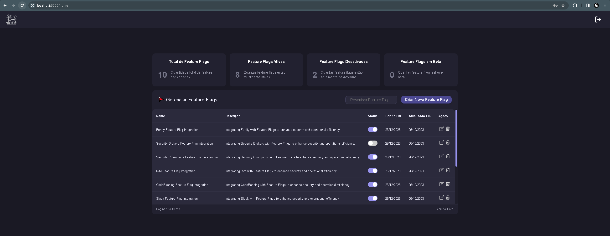

# Flag-SecOps-Hub

<div align="center">



[Visualize o design no Figma](https://www.figma.com/file/bm74nLFsmGi07IZCxIOZ3t/Flag-SecOps-Hub?type=design&node-id=0%3A1&mode=design&t=69BMYVDYpLNlbjmj-1).

<!-- Badges -->

[](https://sonarcloud.io/summary/new_code?id=lucioerlan_Flag-SecOps-Hub)
[](https://sonarcloud.io/summary/new_code?id=lucioerlan_Flag-SecOps-Hub)
[](https://sonarcloud.io/summary/new_code?id=lucioerlan_Flag-SecOps-Hub)
[](https://sonarcloud.io/summary/new_code?id=lucioerlan_Flag-SecOps-Hub)
[](https://sonarcloud.io/summary/new_code?id=lucioerlan_Flag-SecOps-Hub)
[](https://sonarcloud.io/summary/new_code?id=lucioerlan_Flag-SecOps-Hub)
[](https://sonarcloud.io/summary/new_code?id=lucioerlan_Flag-SecOps-Hub)
[](https://sonarcloud.io/summary/new_code?id=lucioerlan_Flag-SecOps-Hub)
[](https://sonarcloud.io/summary/new_code?id=lucioerlan_Flag-SecOps-Hub)
[](https://sonarcloud.io/summary/new_code?id=lucioerlan_Flag-SecOps-Hub)
[](https://sonarcloud.io/summary/new_code?id=lucioerlan_Flag-SecOps-Hub)

<!-- More Badges -->

</div>

Flag SecOps Hub é um projeto para gestão de Feature Flags, autenticação de usuários e controle de acesso, com foco em segurança, performance e escalabilidade. Desenvolvido com práticas modernas e tecnologias de ponta, visa oferecer uma solução robusta e confiável para gerenciamento dinâmico de recursos e funcionalidades em aplicações.

---

## 🛡️ Visão Geral do Projeto

- **Objetivo**: Facilitar a gestão de Feature Flags e controle de acesso em aplicações.
- **Usuários**: Desenvolvedores, gerentes de projeto e equipes de QA que buscam uma gestão eficiente e segura de funcionalidades.
- **Aplicação**: Dividido em duas partes principais - Backend e Frontend, trabalhando em conjunto para uma solução completa.

---

## 🏗️ Arquitetura e Tecnologias

### Backend

- **Arquitetura**: Clean Architecture e DDD para modularidade e manutenção eficiente.
- **Tecnologias**: Node.js, TypeScript, Fastify, MongoDB, Jest, Docker, Swagger, Winston, entre outros.
- **Segurança**: Implementações específicas para garantir a proteção dos dados e das operações.

### Frontend

- **Arquitetura**: Design Atômico para organização eficiente e manutenível dos componentes.
- **Tecnologias**: React, Vite, Redux, Formik, Styled Components, i18next, React Testing Library, Cypress, Storybook, entre outros.
- **Usabilidade e Acessibilidade**: Foco em uma interface amigável e acessível para todos os usuários.
- **Design Figma**: [Visualize o design no Figma](https://www.figma.com/file/bm74nLFsmGi07IZCxIOZ3t/Flag-SecOps-Hub?type=design&node-id=0%3A1&mode=design&t=69BMYVDYpLNlbjmj-1).

---

## 🚀 Como Executar

### 🐳 Docker Compose

Para executar o projeto utilizando Docker Compose:

1. Certifique-se de ter o Docker e o Docker Compose instalados em sua máquina.
2. Na raiz do projeto, execute o comando:
   ```sh
   docker-compose up
   ```
3. O frontend vai estar disponivel em `http://localhost:3000` e o backend em `http://localhost:5000`. Isso vai subir tanto o backend quanto o frontend em containers Docker.

---

### 🧰 Makefile

Para facilitar a execução de comandos, utilize o arquivo Makefile disponível na raiz do projeto:

Para construir as imagens Docker:

```sh
make build
```

Para executar o projeto:

```sh
make up
```

Para parar os serviços:

```sh
make down
```

---

## 📚 Documentação Completa

A documentação do projeto está organizada em documentações específicas para o backend e o frontend, que podem ser acessadas em seus respectivos diretórios `docs`. Veja abaixo como acessar cada uma delas:

### Backend

- **Documentação Interativa Swagger**: Acesse em `http://localhost:5000/documentation` após iniciar o projeto.
- **Docsify**: Para uma visão mais detalhada, a documentação completa está disponível em [Docsify backend](https://github.com/lucioerlan/Flag-SecOps-Hub/tree/main/backend/docs). Execute `npm run docs:serve` na raiz do backend para iniciar o servidor de documentação Docsify.

### Frontend

- **Storybook**: Explore componentes e guias no Storybook acessando `http://localhost:6006` após executar o comando `npm run storybook`.
- **Docsify**: A documentação completa está disponível em [Docsify frontend](https://github.com/lucioerlan/Flag-SecOps-Hub/tree/main/frontend/docs). Execute `npm run docs:serve` na raiz do frontend para iniciar o servidor de documentação Docsify.

---

## 🛠️ Comandos Comuns

- `npm install`: Instala as dependências do projeto.
- `npm run dev`: Inicializa o projeto em modo de desenvolvimento.
- `npm run test`: Executa todos os testes do projeto.
- `npm run lint`: Aplica linting em todo o projeto.

---

## 🧪 Testes

- **Cypress 🌲**: Para executar os testes end-to-end com Cypress, execute o comando `npm run test:cypress:open` e acesse `http://localhost:8080`.

---

## 🌟 CI/CD com GitHub Actions e SonarCloud

O projeto possui integração contínua e entrega contínua (CI/CD) com o GitHub Actions. Os resultados de qualidade de código são monitorados pelo **SonarCloud**, incluindo métricas de bugs, code smells, cobertura de código e muito mais. O CD é realizado na Vercel.

---

## 🧑‍💻 Contribuição

Contribuições são sempre bem-vindas! Seja melhorando a documentação, adicionando novas funcionalidades ou corrigindo bugs, sinta-se à vontade para criar um pull request ou abrir uma issue.

---

## 📃 Licença

Distribuído sob a Licença MIT. Veja `LICENSE` para mais informações.
