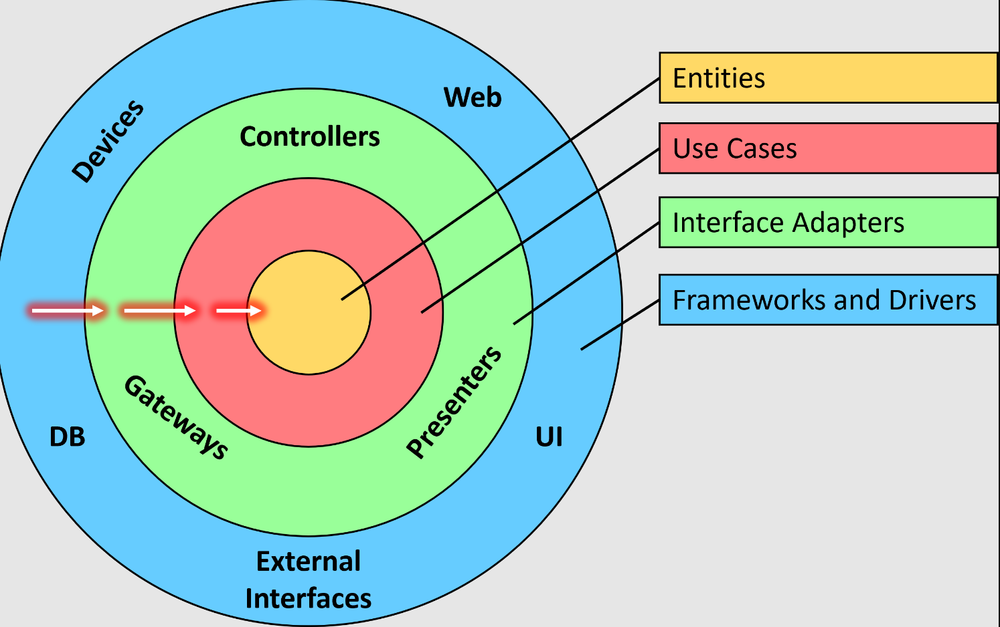

#### Visão Geral

Este documento apresenta a arquitetura que implementei para o backend do Flag SecOps Hub. Vou compartilhar minhas decisões, as razões por trás delas e como elas contribuem para um sistema coeso, eficiente e escalável.

**Visão Geral da Arquitetura**

A arquitetura do backend foi cuidadosamente escolhida para atender às necessidades específicas do Flag SecOps Hub, equilibrando eficiência, escalabilidade e facilidade de manutenção. Aqui estão os principais aspectos dessa arquitetura:

**1. Clean Architecture:**

- Eu escolhi a Clean Architecture para estruturar o backend do projeto. Essa abordagem me permite separar claramente o domínio e a lógica de negócios das interfaces de usuário, frameworks e bancos de dados. A adesão a esta arquitetura resulta em um sistema mais testável, flexível e independente de tecnologia externa.

- Camadas: Dividi a aplicação em distintas camadas (Presentation, Application, Domain, Infrastructure), cada uma com sua responsabilidade específica.
  Independência: Cada camada é independente e interage com as outras apenas através de interfaces bem definidas. 2. Domain-Driven Design (DDD):

- Implementei DDD para alinhar o design do backend com as regras e processos de negócio do Flag SecOps Hub. Esse foco no domínio ajuda a garantir que a base de código reflita fielmente os requisitos e complexidades do projeto, facilitando a manutenção e o desenvolvimento futuro.

- Modelagem de Domínio: O coração do sistema são os modelos de domínio, que definem a estrutura de dados e a lógica de negócios.
  Bounded Contexts: Organizei o código em contextos limitados para manter as funcionalidades relacionadas agrupadas e desacopladas de outras partes do sistema.

