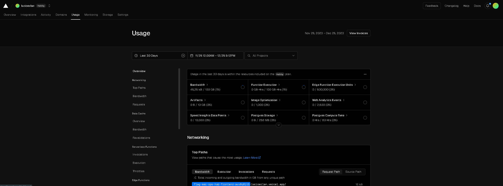

# Integração do Flag SecOps Hub com a Vercel

## Introdução

Este documento explica as razões e os métodos usados na escolha da Vercel para hospedar e gerenciar os recursos de backend e frontend do Flag SecOps Hub. Escolhi a Vercel por suas características práticas e eficientes de gerenciamento.

## Escolhendo a Vercel Como Provedor de Nuvem

### Razões para Escolher a Vercel

1. **Integração com o GitHub:** A facilidade de conectar diretamente com o GitHub e automatizar o fluxo de trabalho de CI/CD foi um grande motivo para escolher a Vercel. Isso torna mais rápido e simples cada atualização de código.

2. **Facilidade no Deploy e Gestão:** A Vercel se destaca pela facilidade no processo de deploy e gerenciamento das aplicações. A interface de usuário e a linha de comando simplificam bastante o gerenciamento dos projetos.

3. **Configuração Flexível:** A capacidade de configurar diferentes caminhos para o projeto permite uma organização prática e eficiente de múltiplos ambientes de desenvolvimento, teste e produção.

4. **Economia:** A estrutura de custo da Vercel, especialmente com o plano gratuito, é atrativa, permitindo começar pequeno e crescer conforme a necessidade, sem grandes gastos iniciais.

5. **Desempenho e Otimização Automática:** Os recursos de otimização automática da Vercel, como compressão de imagens e CDN global, são essenciais para garantir um bom desempenho e tempos de carregamento ágeis.

6. **Segurança Ativa:** A Vercel traz práticas de segurança ativas, incluindo HTTPS automático e atualizações de segurança regulares, mantendo as aplicações seguras contra novas ameaças.

### Implementação no Flag SecOps Hub

- **Hospedagem do Frontend e Backend:** Escolhi hospedar tanto o frontend quanto o backend na Vercel, proporcionando um ambiente unificado e prático para toda a aplicação.

- **Ambientes e Domínios Variados:** Configurei múltiplos estágios (dev, test, prod) com seus próprios domínios ou subdomínios, facilitando o processo de testes e lançamento para produção.

- **Escalabilidade Dinâmica:** A Vercel suporta escalabilidade dinâmica, ajustando-se automaticamente ao tráfego e à demanda, ideal para lidar com picos de acesso ou crescimento constante.

- **Monitoramento Contínuo:** Com a Vercel, tenho acesso a informações detalhadas e insights sobre o desempenho, o que permite um acompanhamento e otimização constantes da aplicação.

## Conclusão

Adotar a Vercel como provedor de nuvem garantiu uma base eficiente e prática para o Flag SecOps Hub, com foco na praticidade, capacidade de expansão e segurança.

