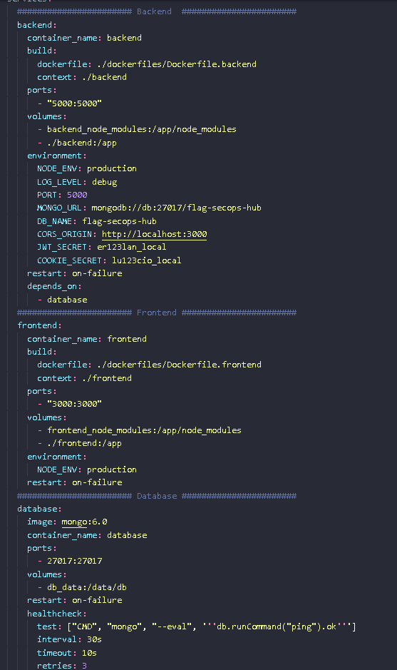

#### Visão Geral

Neste documento, vou detalhar como implementei containers para isolar e gerenciar o ambiente do backend e frontend do Flag SecOps Hub. Utilizei Docker e Docker Compose, ferramentas para garantir que o aplicativo seja fácil de configurar, testar e implantar, independentemente do ambiente local ou de produção.

**Por Que Containers?**
Escolhi usar containers por vários motivos:

- Isolamento: Containers encapsulam o ambiente de execução do aplicativo, garantindo que funcione consistentemente em diferentes máquinas e ambientes.
- Eficiência: Permitem uma utilização mais eficiente dos recursos em comparação com as máquinas virtuais tradicionais, pois compartilham o mesmo kernel do sistema operacional.
- Reprodutibilidade: A configuração do ambiente é definida em arquivos (como Dockerfile e docker-compose.yml), permitindo que qualquer pessoa no projeto recrie o mesmo ambiente rapidamente.
- Portabilidade: Uma vez criado, o container pode ser executado em qualquer sistema que tenha Docker instalado, facilitando a implantação e o escalonamento.
  Docker e Docker Compose

**Dockerfile:**

Criei um Dockerfile que define a imagem do backend do Flag SecOps Hub. Ele especifica o sistema base, as dependências necessárias, os arquivos do projeto e os comandos para rodar o aplicativo.
O Dockerfile é o ponto de partida para construir a imagem Docker do backend, garantindo que todas as dependências e configurações sejam incluídas e preparadas para execução.
Docker Compose:

Para simplificar a gestão de múltiplos containers e suas interdependências, utilizei o Docker Compose. Ele permite definir e rodar múltiplos containers Docker como um único serviço.

Com um arquivo docker-compose.yml, configurei o serviço do backend, banco de dados e o frontend, definindo como eles se interconectam e compartilham dados.
Fluxo de Trabalho e Gestão
Desenvolvimento e Testes:

