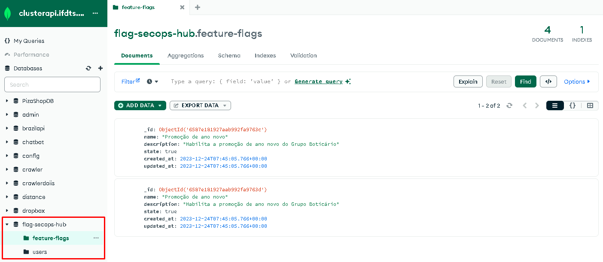

#### Visão Geral

Este documento descreve a escolha do MongoDB, hospedado no Mongo Atlas, como a solução de banco de dados para o Flag SecOps Hub. A decisão de utilizar um banco de dados não relacional reflete as necessidades específicas do projeto em termos de escalabilidade, flexibilidade e performance.

**Escolha do Banco de Dados: MongoDB via Mongo Atlas**

Porque eu resolvi utilizar o MongoDB via Mongo Atlas como banco de dados para o Flag SecOps Hub?

**Razões da Escolha:**

- Modelo de Dados Não Relacional: O Flag SecOps Hub lida com dados que são melhor estruturados como documentos JSON do que tabelas tradicionais. O MongoDB, sendo um banco de dados orientado a documentos, oferece uma estrutura mais flexível e intuitiva para armazenar e manipular esses dados, facilitando operações como atualizações, consultas e integração com a stack de tecnologia J- avaScript/TypeScript usada no projeto.
- Escalabilidade: O MongoDB é conhecido por sua capacidade de escalar horizontalmente, distribuindo dados e carga através de múltiplos servidores.
- Mongo Atlas - Hospedagem Gerenciada na Nuvem: Utilizando o Mongo Atlas, temos acesso a uma versão do MongoDB hospedada e gerenciada na nuvem. Isso nos oferece não apenas a conveniência de não ter que gerenciar a infraestrutura do banco de dados, mas também recursos como backups automáticos, monitoramento, e segurança robusta.
  -Limite de Armazenamento: O plano gratuito do Mongo Atlas oferece um limite de armazenamento que atende às necessidades do projeto, permitindo desenvolver e testar a aplicação sem preocupações imediatas de custos ou capacidade.

**Implementação no Projeto:**

- Modelagem de Dados: Os esquemas de dados do Flag SecOps Hub são projetados para tirar proveito da natureza flexível dos documentos MongoDB.
- Integração com o Backend: A integração entre o MongoDB e o backend do Flag SecOps Hub é realizada usando drivers oficiais do mongodb.
- Performance e Otimizações: Otimizações específicas, como índices bem planejados, são implementadas para garantir consultas rápidas e eficientes, mesmo à medida que o volume de dados cresce.
- Segurança e Backup: Utilizei as configurações de segurança fornecidas pelo Mongo Atlas, incluindo criptografia em repouso e em trânsito.

