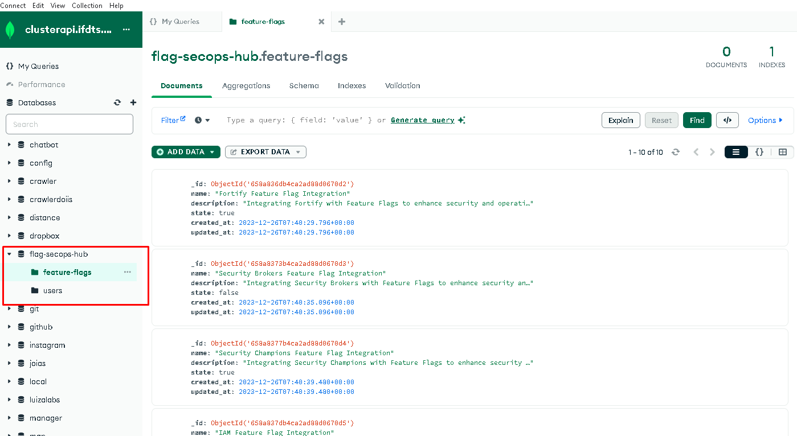

# Escolha do MongoDB para o Flag SecOps Hub

## Visão Geral

Este documento explica por que escolhi o MongoDB, hospedado no Mongo Atlas, como solução de banco de dados para o Flag SecOps Hub. A opção por um banco de dados não relacional atende às necessidades do projeto em termos de capacidade de expansão, praticidade e desempenho.

## Por Que MongoDB via Mongo Atlas?

### Razões para Escolher o MongoDB

- **Modelo de Dados Não Relacional:** O Flag SecOps Hub trabalha com dados que se encaixam melhor em um formato de documentos JSON. O MongoDB, como um banco de dados baseado em documentos, oferece uma maneira mais prática e flexível para armazenar e mexer com esses dados, facilitando tarefas como atualizações e consultas.
- **Expansão Facilitada:** O MongoDB é bem reconhecido por sua habilidade de crescer horizontalmente, espalhando dados por vários servidores para lidar com mais carga de trabalho.
- **Mongo Atlas - Hospedagem na Nuvem:** O Mongo Atlas me permite usar uma versão do MongoDB hospedada e cuidada na nuvem. Isso traz a vantagem de não precisar lidar com a infraestrutura por conta própria, além de ter acesso a backups automáticos, monitoramento e uma segurança firme.
  - **Limite de Armazenamento Ajustado:** O plano gratuito do Mongo Atlas vem com um limite de armazenamento que serve bem ao projeto, permitindo desenvolver e testar sem muita preocupação com custos ou espaço.

### Implementação no Flag SecOps Hub

- **Modelagem de Dados:** Os esquemas de dados foram feitos para aproveitar bem a flexibilidade dos documentos do MongoDB.
- **Integração com o Backend:** A conexão entre o MongoDB e o backend é feita usando os drivers oficiais, garantindo uma integração suave e segura.
- **Desempenho Afinado:** Implementei índices e outras otimizações para assegurar que as consultas sejam rápidas e eficientes, especialmente conforme aumentamos a quantidade de dados.
- **Preocupação com a Segurança:** Aproveitei as ferramentas de segurança do Mongo Atlas, que incluem criptografia dos dados em repouso e em trânsito.

## Conclusão

A escolha do MongoDB hospedado no Mongo Atlas para o Flag SecOps Hub foi baseada em uma série de vantagens práticas e técnicas que ele oferece.

