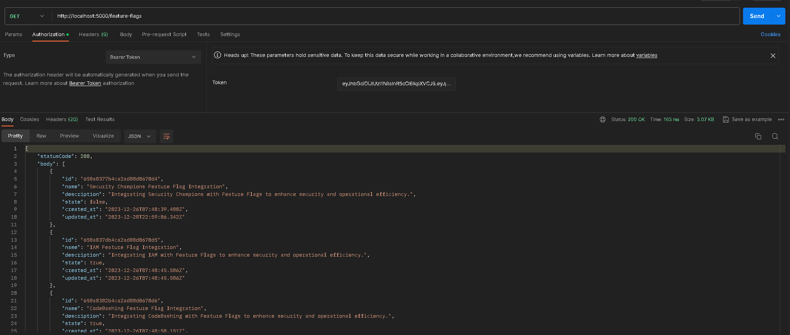

#### Visão Geral

Este documento oferece uma visão detalhada das práticas e configurações de segurança implementadas no backend do Flag SecOps Hub. Entendemos que a segurança é uma parte crítica do desenvolvimento de aplicações, especialmente em ambientes de backend, onde dados sensíveis são manipulados e armazenados. Portanto, este documento detalha cada middleware e técnica de segurança empregada para proteger o sistema contra vulnerabilidades e ataques.

Middlewares e Configurações de Segurança

**1. Authenticate Middleware (authenticate.middleware.ts):**

Vulnerabilidade: Acesso não autorizado e elevação de privilégios.
Exploitação: Atacantes podem tentar acessar recursos protegidos sem autenticação adequada ou utilizando credenciais roubadas.
Defesa: O middleware de autenticação verifica tokens JWT ou outros métodos de autenticação para cada requisição, garantindo que apenas usuários legítimos tenham acesso. Utilizamos técnicas como a renovação constante de tokens e validações rigorosas para prevenir roubo ou falsificação de identidade.

**2. Compress Middleware (compress.middleware.ts):**

Vulnerabilidade: Latência e ineficiência de rede.
Exploitação: Sem compressão, o aplicativo pode ser suscetível a problemas de performance, tornando-o lento ou menos responsivo.
Defesa: A compressão de respostas HTTP minimiza o tamanho dos dados transmitidos, melhorando o tempo de resposta e reduzindo a carga no servidor e na rede do cliente.

**3. Helmet Middleware (helmet.middleware.ts):**

Vulnerabilidade: Ataques baseados em headers HTTP

**Exploração:**

- Clickjacking: Atacantes enganam os usuários para clicarem em algo diferente do que percebem, potencialmente revelando informações confidenciais ou assumindo controle sobre suas ações no site.
- Sniffing de MIME Type: Navegadores tentam "adivinhar" o MIME type de um documento e executá-lo, o que pode ser explorado para executar tipos MIME não intencionais, especialmente quando o servidor não especifica um.
- Injeção de Scripts: Ataques como Cross-site Scripting (XSS) podem ocorrer quando o aplicativo permite que dados não confiáveis sejam enviados ao navegador sem devida validação ou escape.
  Defesa Implementada:
- Content Security Policy (CSP): O Helmet configura CSP para limitar as fontes de conteúdo executável, prevenindo a injeção de scripts maliciosos.
- X-Frame-Options: Define opções para prevenir clickjacking, proibindo o site de ser exibido em iframes de domínios não confiáveis.
- X-Content-Type-Options: Impede que navegadores tentem inferir os MIME types, usando o header nosniff para assegurar que os MIME types declarados não sejam sobrescritos ou mal interpretados.

**Benefícios:**

- Protege os usuários contra uma variedade de ataques explorando headers HTTP.
- Assegura que o conteúdo servido seja executado como pretendido e somente em contextos seguros e apropriados.
- Mantém a integridade do conteúdo e a segurança da interação do usuário com o aplicativo.

**4. CORS Middleware (cors.middleware.ts):**

Vulnerabilidade: Cross-Origin Resource Sharing (CORS) mal configurado.
Exploitação: Configurações inadequadas de CORS podem permitir que sites maliciosos acessem recursos ou realizem ações no backend sem o conhecimento do usuário.
Defesa: O middleware CORS define políticas estritas sobre quais domínios podem interagir com o backend, limitando o acesso a origens confiáveis e prevenindo abusos.

**5. CSRF Middleware (csrf.middleware.ts):**

Vulnerabilidade: Cross-Site Request Forgery (CSRF)
Exploração: Atacantes exploram a confiança que um site tem no navegador do usuário. Eles enganam o usuário final a enviar uma requisição para uma aplicação web com a qual interagiram anteriormente, com o navegador do usuário incluindo detalhes da sessão como cookies, tokens, etc. Isso pode levar a alterações não autorizadas, como mudança de endereço de email, transferências bancárias, ou qualquer outra ação que o usuário possa realizar legalmente na aplicação.

##### Exemplo de Exploitação:

- Um usuário está logado no SecOps Hub e simultaneamente visita um site malicioso.
- Esse site malicioso contém um formulário oculto apontando para uma ação sensível no SecOps Hub (como alterar detalhes da conta ou postar algo em nome do usuário).
- Quando o usuário clica em algo no site malicioso, o formulário é submetido ao SecOps Hub sem que o usuário perceba, utilizando as credenciais de autenticação do usuário para essa ação.

  **Defesa Implementada:**

- Token CSRF: Integramos tokens CSRF em cada formulário e requisição sensível. Esses tokens são únicos para cada sessão de usuário e ação, tornando impossível para um atacante prever ou clonar um token válido.
- Validação Dupla: Além de tokens CSRF, implementamos verificações adicionais de referência e validação de origem da requisição para garantir que cada pedido ao servidor seja legítimo e intencional.
- Estratégia de Same-Site Cookies: Configuramos cookies para serem estritamente same-site quando possível, evitando que sejam enviados automaticamente em requisições iniciadas por outros sites.

**Benefícios:**

- A implementação dessas defesas protege os usuários contra ataques que tentam realizar ações prejudiciais em nome deles.
- Aumenta a confiança no sistema de segurança do aplicativo, assegurando que as ações executadas sejam autênticas e autorizadas.
- Diminui significativamente a superfície de ataque para explorações baseadas em CSRF, protegendo tanto a aplicação quanto o usuário final.

**6. Cookie Middleware (cookie.middleware.ts):**

Vulnerabilidade: Roubo de sessão e Cross-Site Scripting (XSS).
Exploitação: Cookies sem as devidas configurações de segurança podem ser roubados ou manipulados, levando a roubo de sessão ou ataques XSS.
Defesa: Configuramos flags como HttpOnly e Secure nos cookies para prevenir o acesso através de scripts do lado do cliente e garantir que sejam transmitidos apenas em conexões seguras (HTTPS).

**7. Rate Limit Middleware (rate-limit.middleware.ts):**

Vulnerabilidade: Ataques de força bruta e Denial-of-Service (DoS)

**Exploração:**

- Ataques de Força Bruta: Atacantes tentam incessantemente adivinhar credenciais de usuário ou chaves de acesso, fazendo múltiplas tentativas de login ou requisições.
- Ataques de DoS: Enviando uma grande quantidade de requisições em um curto período, atacantes sobrecarregam o servidor, levando a uma degradação do serviço ou até mesmo à sua indisponibilidade.

**Defesa Implementada:**

- Limitação de Taxa: Impomos limites estritos no número de requisições que podem ser feitas a uma API ou endpoint em um determinado período de tempo por IP ou usuário.
- Alívio de Carga: Em momentos de carga alta, a limitação de taxa assegura que o sistema continue responsivo para usuários legítimos, distribuindo a carga de forma mais equitativa e prevenindo o monopólio de recursos.

**Benefícios:**

- Mitiga efetivamente ataques de força bruta, reduzindo a chance de acesso não autorizado através de adivinhação de senha ou outras técnicas de exploração.
- Protege contra ataques de DoS, mantendo a disponibilidade e a integridade do serviço mesmo sob tentativas de sobrecarga.
- Assegura uma distribuição justa e eficiente dos recursos do servidor, mantendo a qualidade e a velocidade do serviço para todos os usuários.

**8. Session Middleware (session.middleware.ts):**

Vulnerabilidade: Sequestro de sessão e ataques de fixação de sessão
Exploração:

- Sequestro de Sessão: Atacantes capturam o token de sessão (como um JWT) e o usam para se passar pelo usuário legítimo.
- Fixação de Sessão: Atacantes forçam a sessão do usuário a utilizar um identificador de sessão específico conhecido pelo atacante, permitindo que eles assumam a sessão após o usuário autenticar.

**Defesa Implementada:**

- Rotação de Tokens: Regularmente invalidamos e reemitimos tokens de sessão para minimizar a janela de oportunidade para sequestro de sessão.
  HTTPS Estrito: Exigimos o uso de HTTPS para todas as comunicações, assegurando que os tokens sejam transmitidos de forma segura e protegidos contra interceptação.
- Armazenamento Seguro de Sessão: Utilizamos storages seguros e configuramos o middleware para usar opções de segurança como sameSite e secure flags em cookies.

**Benefícios:**

- Protege contra o uso não autorizado de tokens de sessão, garantindo que as sessões dos usuários sejam seguras e privadas.
- Reduz o risco associado ao sequestro ou fixação de sessão, mantendo a integridade e a confidencialidade das interações do usuário.
  decode_jwt

**Recomendação para Uso de JWT entre Frontend e Backend:**

- Uso Seguro de HTTPS: Sempre transmita tokens JWT sobre HTTPS para evitar interceptação durante a transmissão.
- Armazenamento Seguro: No lado do cliente (frontend), armazene o JWT de forma segura, preferencialmente em memória, como em um estado de aplicativo, ou em HTTPOnly cookies se persistência for necessária.
- Validação e Renovação: O backend deve validar o JWT a cada requisição, verificando assinatura, expiração, e emissor. Implemente a renovação de tokens para manter as sessões ativas seguras.
- Minimizar Payloads: Embora os JWTs possam conter uma quantidade considerável de informações, minimize o que você inclui. Informações sensíveis nunca devem ser armazenadas no payload do JWT.
- Rotas de Logout: Implemente rotas que permitem aos usuários deslogar, invalidando o token atual e assegurando que não possa ser usado novamente.

