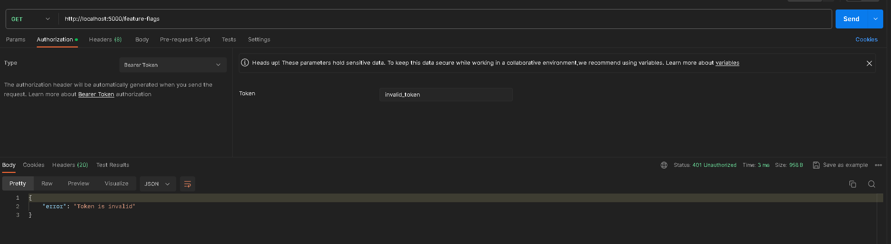
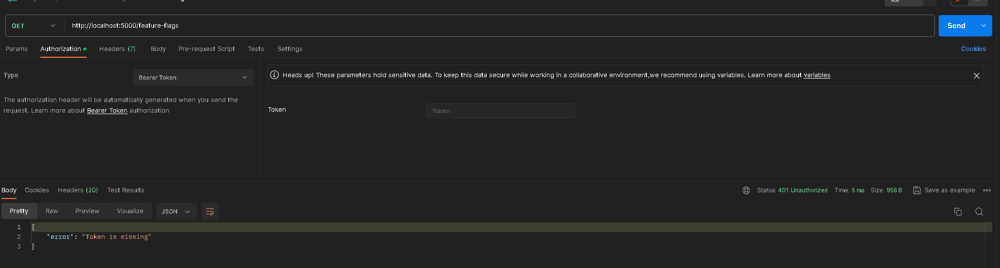
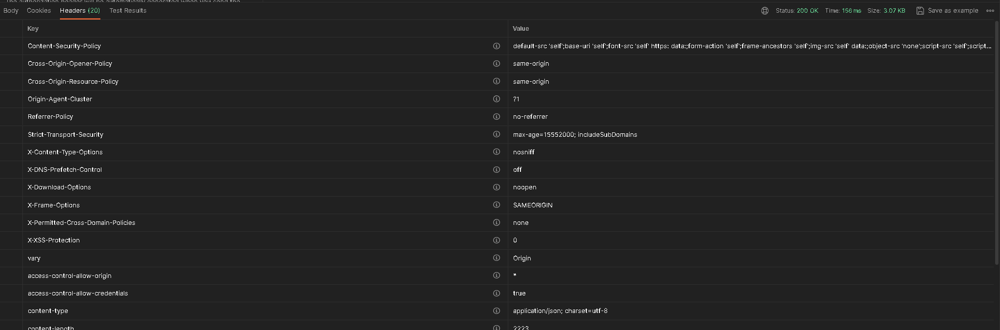
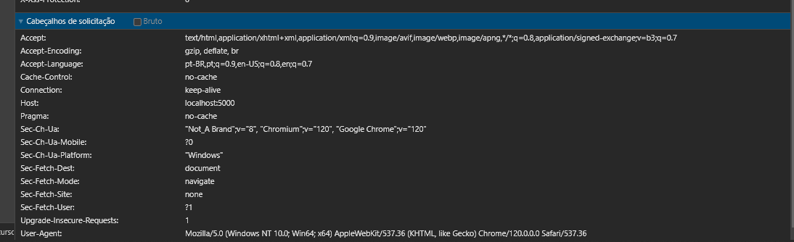

# Práticas de Segurança no Backend do Flag SecOps Hub

## Visão Geral

Este texto detalha as práticas e configurações de segurança que implementei no backend do Flag SecOps Hub. Reconheço a importância crítica da segurança no desenvolvimento de aplicações, especialmente em ambientes de backend onde dados sensíveis são manipulados e armazenados. Aqui estão descritas as técnicas e os middlewares de segurança utilizados para proteger o sistema.

## Middlewares e Configurações de Segurança

### 1. Authenticate Middleware (authenticate.middleware.ts)

- **Vulnerabilidade:** Acesso não autorizado e elevação de privilégios.
- **Defesa:** Verifico tokens JWT ou outros métodos de autenticação em cada requisição para assegurar que somente usuários autenticados tenham acesso.

### 2. Compress Middleware (compress.middleware.ts)

- **Vulnerabilidade:** Latência e ineficiência de rede.
- **Defesa:** Comprimo as respostas HTTP para minimizar o tamanho dos dados transmitidos, melhorando o tempo de resposta e reduzindo a carga no servidor e na rede.

### 3. Helmet Middleware (helmet.middleware.ts)

- **Vulnerabilidade:** Ataques baseados em headers HTTP.
- **Defesa:** Configuro várias medidas de segurança para proteger contra clickjacking, sniffing de MIME type e XSS, incluindo Content Security Policy, X-Frame-Options e X-Content-Type-Options.

### 4. CORS Middleware (cors.middleware.ts)

- **Vulnerabilidade:** CORS mal configurado.
- **Defesa:** Defino políticas estritas sobre quais domínios podem interagir com o backend, limitando o acesso apenas a origens confiáveis.

### 5. CSRF Middleware (csrf.middleware.ts)

- **Vulnerabilidade:** Cross-Site Request Forgery.
- **Defesa:** Utilizo tokens CSRF e validações adicionais para garantir que todas as requisições sejam legítimas e intencionais, protegendo contra ataques que realizam ações prejudiciais em nome dos usuários.

### 6. Cookie Middleware (cookie.middleware.ts)

- **Vulnerabilidade:** Roubo de sessão e XSS.
- **Defesa:** Configuro cookies com flags como HttpOnly e Secure para prevenir acesso indesejado e garantir uma transmissão segura.

### 7. Rate Limit Middleware (rate-limit.middleware.ts)

- **Vulnerabilidade:** Ataques de força bruta e DoS.
- **Defesa:** Imponho limites na quantidade de requisições permitidas por IP ou usuário para proteger contra sobrecarga e acesso não autorizado.

### 8. Session Middleware (session.middleware.ts)

- **Vulnerabilidade:** Sequestro e fixação de sessão.
- **Defesa:** Roto regularmente os tokens de sessão e exijo comunicação segura via HTTPS, além de armazenar tokens em locais seguros.

---

## 🎯 Roteiro Futuro: Onde Desejo Aprimorar o Uso de JWT no Frontend e Backend

- [x] **Uso Seguro de HTTPS:** Garanta a transmissão de tokens JWT somente através de HTTPS.
- [ ] **Armazenamento Seguro no Frontend:** Mantenha o JWT em memória ou em cookies HTTPOnly.
- [ ] **Validação e Renovação no Backend:** Valide o JWT a cada requisição e renove-o regularmente.
- **Minimizar Payloads:** Inclua apenas informações essenciais nos JWTs e evite dados sensíveis.
- [ ] - **Rotas de Logout:** Implemente rotas que permitam aos usuários invalidar tokens ativos.
