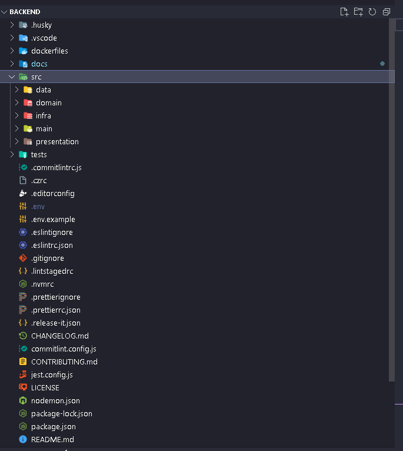

#### Visão Geral

Este documento descreve a estrutura organizacional do código do backend do Flag SecOps Hub, detalhando a disposição dos diretórios, arquivos e a lógica por trás da organização adotada.

**Organização dos Diretórios e Arquivos**

A estrutura do projeto está organizada de forma a refletir claramente as camadas de arquitetura, separando preocupações e facilitando a localização e o gerenciamento de código. Aqui está como os principais diretórios estão organizados:

- **/src** - Diretório Raiz:
- **/data:** Contém os módulos responsáveis pelo gerenciamento de dados, incluindo acesso a bancos de dados, repositórios e qualquer lógica relacionada à persistência e recuperação de dados.
- **/domain:** O coração do sistema, onde as entidades, regras de negócio e interfaces de repositório são definidas. Este diretório reflete o modelo do domínio e é mantido isolado de influências externas.
- **/infra:** Implementa os detalhes técnicos necessários para o sistema funcionar, como configuração de banco de dados, comunicação com serviços externos e implementações concretas de interfaces definidas no domínio.
- **/main:** Ponto de entrada da aplicação. Contém a configuração inicial, o servidor HTTP, a ligação de rotas e a inicialização de serviços essenciais.
- **/presentation:** Gerencia a camada de apresentação, tratando de requisições e respostas, definindo os controladores, rotas e qualquer lógica relacionada à interação com o cliente ou serviços externos.

**Explicação da Estrutura**

A organização do código no Flag SecOps Hub foi projetada para facilitar o desenvolvimento e a manutenção do sistema. Aqui estão alguns pontos-chave sobre a estrutura:

- Separation of Concerns: Cada diretório tem um propósito claro e específico, reduzindo o acoplamento e aumentando a coesão. Isso simplifica a compreensão do código e facilita a manutenção e a expansão do sistema.
- Reflecting Architecture: A estrutura reflete a arquitetura Clean e DDD adotada, com uma clara distinção entre as camadas de domínio, aplicação, infraestrutura e apresentação. Isso garante que o código de negócios permaneça isolado de detalhes de implementação e frameworks.
- Modularity: O código é modular, com componentes e funcionalidades agrupados logicamente. Isso permite reutilizar código, substituir partes do sistema com facilidade e gerenciar dependências de forma mais eficaz.
- Scalability: A estrutura é projetada para crescer com o projeto. Novos componentes, serviços e módulos podem ser adicionados de forma organizada, mantendo a base de código manejável e compreensível.

