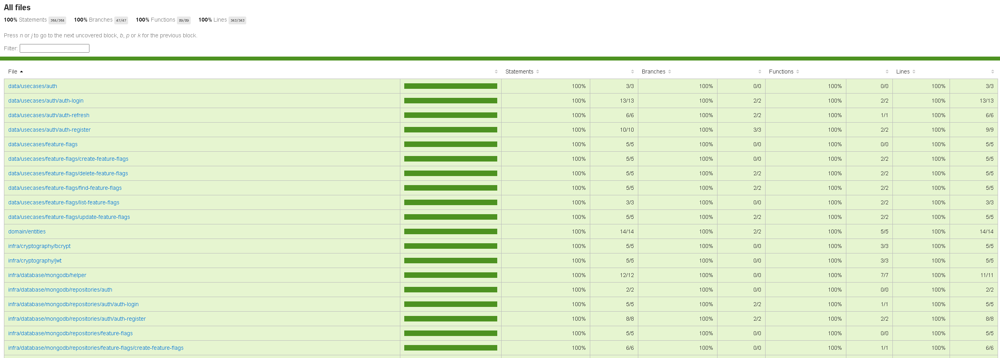
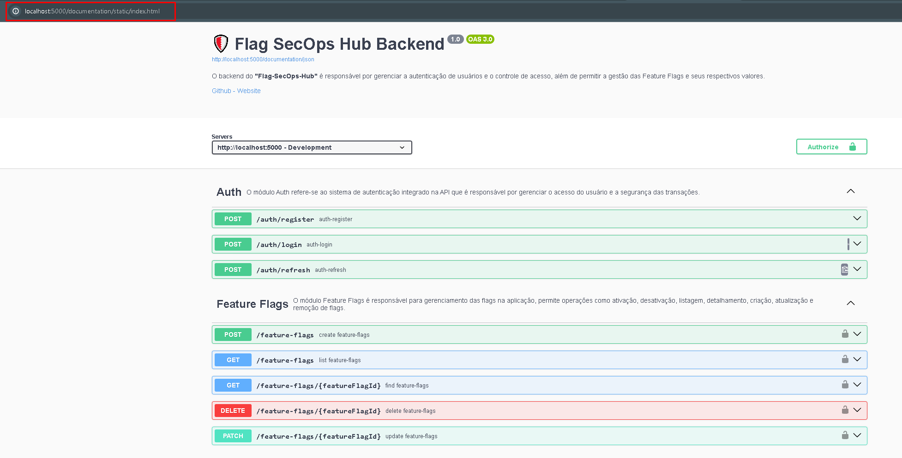

#### Visão Geral

Este documento descreve a estratégia e implementação dos testes que realizei no backend do Flag SecOps Hub. Como desenvolvedor, acredito que os testes são vitais para garantir a qualidade, estabilidade e confiabilidade do sistema. Aqui, detalho como utilizei testes unitários para validar a lógica e as funcionalidades do projeto, garantindo que o código não só atenda às expectativas de negócio, mas também seja robusto e manutenível.

**Estratégia de Testes**
Ferramenta que utilizei: Jest

Resolvi escolher o Jest pela sua eficiência e facilidade de uso, o Jest fornece uma estrutura de testes completa e bem documentada, com suporte a mocks, stubs, spy, e outros recursos úteis.

**Testes Unitários**

- Implementei testes unitários focados em pequenas partes do sistema, geralmente funções ou métodos individuais. Cada teste unitário é independente e visa verificar se uma unidade específica funciona conforme esperado.
- Padrão Triple-A: Segui o padrão Arrange-Act-Assert para estruturar meus testes. Primeiro, eu configuro o ambiente necessário para o teste (Arrange), executo a unidade sob teste (Act) e, por fim, verifico se o resultado corresponde ao esperado (Assert).
- Mocking e Stubs: Utilizei mocks e stubs para simular dependências externas, garantindo que os testes se concentrem exclusivamente na lógica que está sendo testada e não sejam afetados por falhas ou comportamentos externos.

**Mocking e Stubs:**

Mocks e stubs é muito bom para isolar os testes de dependências externas, permitindo que cada teste unitário se concentre exclusivamente na lógica sob teste.

**Foco dos Testes**

Regras de Negócio: Priorizei o teste de funções que executam regras de negócio críticas e manipulação de dados, garantindo que elas funcionem corretamente sob várias condições.
-Validações: As funções que validam a entrada de dados ou formatam a saída são testadas para garantir que rejeitem entradas inválidas e formatem os dados corretamente.
-Integrações Importantes: Embora os testes unitários se concentrem na lógica interna, também verificamos como as unidades se integram a serviços críticos, utilizando mocks para representar essas integrações externas.
-Importância dos Testes Unitários
-Os testes unitários não são apenas uma tarefa de verificação, mas uma parte integrante do desenvolvimento. Eles aumentam a confiança nas mudanças realizadas, facilitam a detecção de erros precocemente, e funcionam como documentação viva do comportamento esperado do sistema.

**Integração com Swagger para Documentação da API**

Swagger-UI: Implementei o Swagger-UI no projeto para criar uma documentação interativa da API. Isso permite que os usuários e desenvolvedores visualizem e interajam com a API de maneira fácil e clara, facilitando o entendimento e o uso dos endpoints disponíveis.

**Vantagens da Integração com Swagger:**

Visualização Intuitiva: O Swagger oferece uma interface gráfica onde os endpoints, parâmetros, e modelos de dados são apresentados de forma clara e estruturada.
Interatividade: Usuários podem testar diretamente os endpoints através da interface do Swagger, o que ajuda na validação rápida das funcionalidades e no entendimento do comportamento da API.
Manutenção e Evolução: A documentação evolui junto com a API, assegurando que as mudanças sejam refletidas em tempo real e que a documentação permaneça atualizada e relevante.

