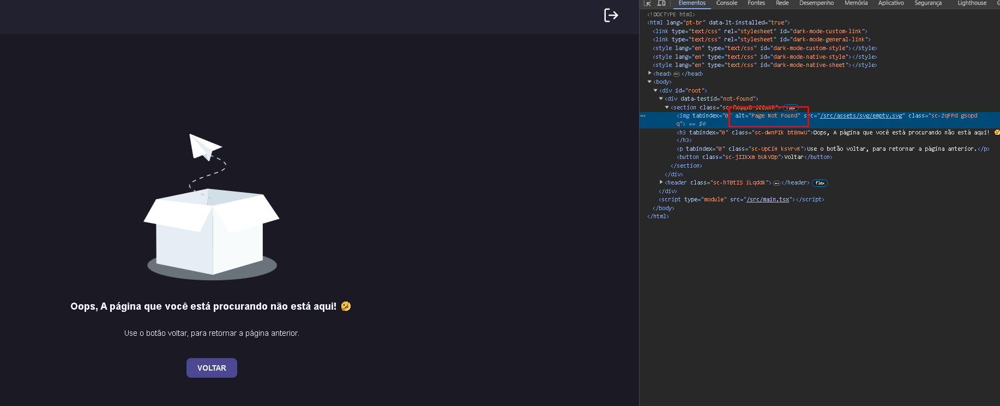
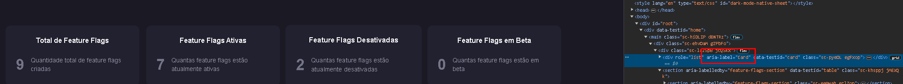

#### Visão Geral

Este documento destina-se a fornecer uma visão das implementações técnicas específicas adotadas em **Flag-SecOps-Hub** para garantir a acessibilidade do site conforme as Diretrizes de Acessibilidade para Conteúdo Web (WCAG). A seguir, estão as principais características técnicas incorporadas:

- [x] Acessibilidade do teclado
      Textos Alternativos em Imagens `(alt Text)`
      Implementação: Todos os elementos  no site são fornecidos com atributos alt descriptivos para garantir que o conteúdo visual seja acessível para usuários de leitores de tela.
      

- [x] Navegação por Teclado (tabindex)
      Implementação: Utilização do atributo tabindex para gerenciar a ordem de foco dos elementos interativos, garantindo uma navegação lógica e intuitiva por teclado.
      

- [x] Atributos (aria-labels, aria-hidden, role)
      aria-labels: Utilizados para fornecer rótulos para elementos interativos quando os rótulos visuais não são suficientes ou estão ausentes.
      aria-hidden: Empregado para ocultar elementos decorativos ou não essenciais dos leitores de tela.
      role: Atributos de papel definidos para elementos não semânticos para transmitir sua função.
      
