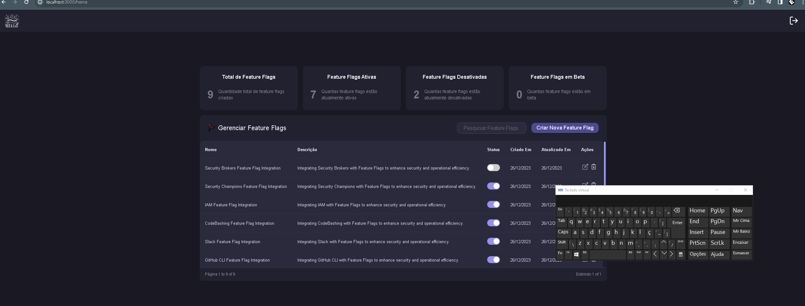

# Acessibilidade em Flag-SecOps-Hub

## Visão Geral

Este documento apresenta as medidas técnicas específicas que adotei para garantir a acessibilidade do site Flag-SecOps-Hub, alinhadas às Diretrizes de Acessibilidade para Conteúdo Web (WCAG). Aqui estão as características técnicas principais que incorporei:

### Acessibilidade do Teclado

- **Textos Alternativos em Imagens (`alt Text`):** Assegurei que todos os elementos `` no site possuam atributos `alt` descritivos, tornando o conteúdo visual acessível a usuários de leitores de tela.

  

### Navegação por Teclado (tabindex)

- **Implementação de Tabindex:** Adicionei o atributo `tabindex` para gerenciar a ordem de foco dos elementos interativos. Isso garante uma navegação lógica e intuitiva pelo teclado.

### Atributos ARIA (aria-labels, aria-hidden, role)

- **aria-labels:** Usei para fornecer rótulos a elementos interativos quando os rótulos visuais não são claros ou estão ausentes.
- **aria-hidden:** Empreguei para ocultar elementos decorativos ou não essenciais dos leitores de tela.
- **role:** Defini atributos de papel para elementos não semânticos para indicar claramente sua função.

  

## Conclusão

Implementei uma série de técnicas e práticas para garantir a acessibilidade do Flag-SecOps-Hub. Essas medidas visam oferecer uma experiência inclusiva e acessível.
