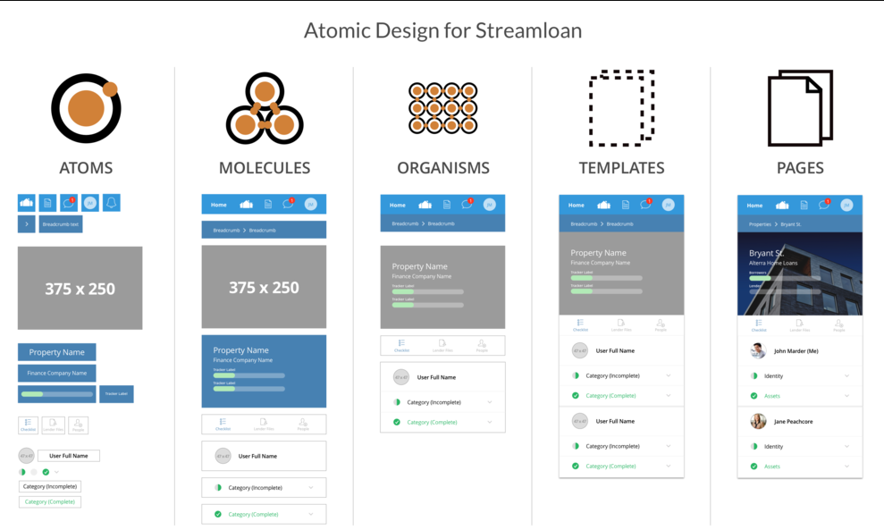

# Abordagem Arquitetural do Frontend do Flag-SecOps-Hub

## Visão Geral

Este documento explica a abordagem arquitetural que escolhi para o desenvolvimento do front-end do Flag-SecOps-Hub, centrada no Atomic Design. Optei por essa metodologia para criar uma interface que seja consistente, reutilizável e que possa se adaptar facilmente às mudanças.

## O que é Atomic Design?

Atomic Design é uma metodologia que constrói sistemas de design de forma consistente, utilizando cinco níveis distintos:

- **Átomos:** São os elementos mais básicos, como botões e ícones.
- **Moléculas:** Conjuntos de átomos que funcionam juntos, como um formulário de pesquisa.
- **Organismos:** Conjuntos de moléculas que formam partes mais complexas da interface, como cabeçalhos completos.
- **Templates:** Layouts gerais que demonstram onde os organismos são colocados, definindo a estrutura da página.
- **Páginas:** Instâncias específicas de templates com conteúdo real, mostrando o que o usuário final verá.

## Por que Atomic Design?

Escolhi o Atomic Design para melhorar a eficiência no desenvolvimento e manter a consistência em todo o projeto. Essa abordagem me permitiu:

- **Reutilização de Componentes:** Aproveitar os mesmos componentes em diferentes partes do site, facilitando a manutenção e a escalabilidade.
- **Consistência Visual:** Manter uma aparência uniforme em todo o projeto, o que melhora a experiência do usuário.
- **Adaptabilidade:** Facilitar ajustes e mudanças no design, já que a modificação de um átomo ou molécula pode ser refletida em toda a aplicação.

## Conclusão

Adotar o Atomic Design no desenvolvimento do front-end do Flag-SecOps-Hub foi uma decisão que visou aumentar a eficiência, consistência e adaptabilidade do projeto. Com essa metodologia, o sistema de design se torna uma base sólida para a interface do usuário, pronta para crescer e evoluir junto com as necessidades do projeto.
