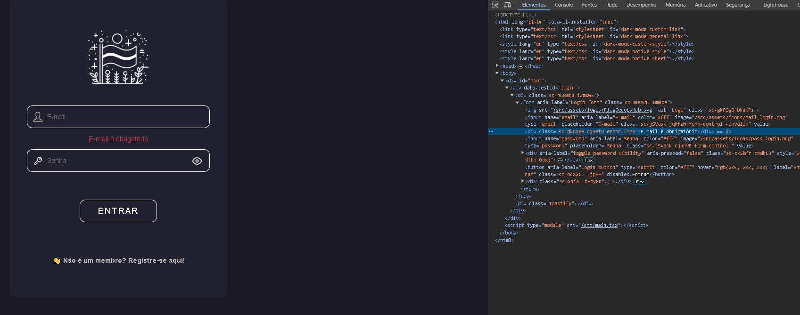

#### Visão Geral

Este documento detalha as bibliotecas e pacotes centrais utilizados no Flag-SecOps-Hub. Como cada pacote contribui para a funcionalidade, desempenho e segurança do site.

Dependências
**@reduxjs/toolkit**
Função: Gerencia e simplifica o estado global da aplicação.
Justificativa: Optei pelo @reduxjs/toolkit por sua eficiente abstração sobre o Redux, proporcionando não só uma estrutura modular com 'slices' para organizar o estado, mas também por outras características distintas:

Algumas das principais características são:

- CreateAsyncThunk: Facilita o manejo de lógica assíncrona, como operações de fetch(API), dentro do Redux.
- CreateSlice: Simplifica a criação de reducers e actions, reduzindo a verbosidade do código.

---

- Immer Integration: Permite escrever "mutações" de forma mais direta e segura, sem preocupações com a imutabilidade do estado. (Não deu tempo de implementar, mas é uma feature que pretendo adicionar no futuro)

**formik/yup**
Função: Facilita a criação e validação de formulários, gerenciando estados, validações e manipulações de submissão de forma eficiente.
Justificativa: Formik, em conjunto com Yup, proporciona uma solução para a construção de formulários seguros. Yup permite definir esquemas de validação que são usados para validar dados do lado do cliente antes de qualquer processamento ou envio ao servidor. Essa validação de entrada é importante para a segurança da aplicação, pois ajuda a prevenir várias vulnerabilidades:

- Injeção SQL: Ao validar e sanitizar entradas de texto, Yup ajuda a assegurar que strings maliciosas não sejam inseridas em queries SQL, protegendo contra ataques que buscam alterar consultas ou acessar dados sensíveis no banco de dados.
- Cross-Site Scripting (XSS): Yup pode ser configurado para validar e remover conteúdo suspeito ou malicioso de entradas, ajudando a prevenir que scripts indesejados sejam injetados e executados no lado do cliente, protegendo os usuários de scripts que possam roubar informações ou corromper a experiência do usuário.
- Cross-Site Request Forgery (CSRF): Embora Yup em si não lide diretamente com CSRF, a validação de formulários ajuda a garantir que as ações executadas sejam legítimas e esperadas, o que, quando combinado com tokens CSRF e outras medidas, pode fortalecer a proteção contra ataques CSRF.
  Além disso, a validação de formulários com Formik e Yup contribui para a integridade dos dados, assegurando que apenas informações formatadas corretamente sejam processadas. Isso reduz erros de usuário, simplifica o tratamento de dados no backend e melhora a qualidade geral dos dados coletados.

  

**i18next e react-i18next**
Função: Facilita a internacionalização e localização, permitindo a tradução do site para diferentes idiomas.
Justificativa: Escolhi i18next e react-i18next pela sua flexibilidade e facilidade em adicionar suporte multilíngue. Ele oferece uma série de recursos que tornam a internacionalização mais simples e eficiente:

- Centralização de Recursos: Todos os textos são gerenciados em arquivos de recursos separados, facilitando atualizações e manutenções.
- Detecção de Idioma Automática: Detecta o idioma do usuário e carrega as traduções apropriadas, proporcionando uma experiência personalizada.
- Fallback Language: Garante que, mesmo que uma tradução esteja ausente, o usuário receberá o texto em um idioma alternativo pré-determinado.
- Integração com Frameworks: Trabalha bem com outras bibliotecas e frameworks, tornando o processo de internacionalização integrado e menos propenso a erros.
  Essas características tornam o desenvolvimento de aplicativos multilíngues mais acessível, rápido e confiável, promovendo uma melhor experiência do usuário global.

**styled-components**

Função: Permite a escrita de CSS estilizado diretamente nos componentes React, oferecendo um escopo isolado e maior reutilização.
Justificativa: Styled-components é amplamente adotado por:

- Escopo Isolado: Cada componente tem seu próprio escopo de estilo, prevenindo conflitos e vazamentos de estilo indesejados.
- Reutilização e Tematização: Facilita a criação de temas e a reutilização de estilos, permitindo que a mesma base de código atenda a diferentes aparências e temas.
- Manutenção Simplificada: Como os estilos estão acoplados aos componentes, mudanças em um componente específico podem ser feitas sem afetar outros, tornando o código mais fácil de manter e entender.
- Dynamic Styling: Estilos podem ser alterados com base nas props do componente, permitindo alterações dinâmicas e interativas de estilo com base no estado ou propriedades.
