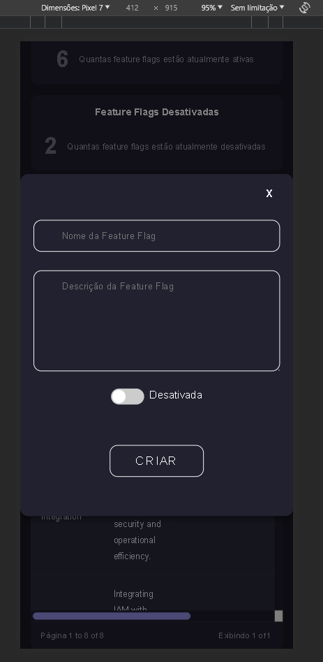
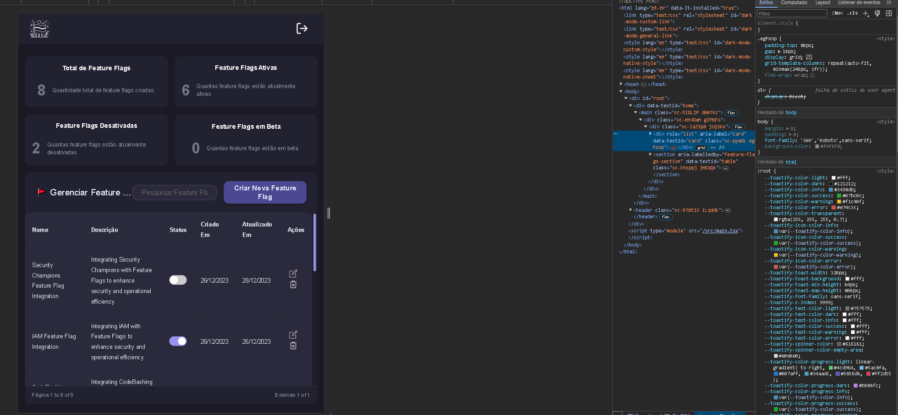

#### Visão Geral

Este documento descreve as implementações técnicas de responsividade adotadas no projeto Flag SecOps Hub para garantir que a aplicação ofereça uma experiência de usuário ótima em uma ampla variedade de dispositivos e tamanhos de tela.

Técnicas Implementadas

**1. Media Queries:**

Descrição: Optei por usar media Queries são um recurso fundamental do CSS que permitem aplicar estilos diferentes baseados em características do dispositivo, como largura, altura e resolução da tela.
Implementação: Utilizamos Media Queries para adaptar layouts, ajustar tamanhos de fontes, e alterar propriedades de estilo conforme a necessidade, garantindo que o aplicativo se ajuste de maneira fluida a diferentes tamanhos de tela.
Benefícios: As Media Queries permitem um controle fino sobre a apresentação do aplicativo em dispositivos variados, melhorando a usabilidade e a acessibilidade.

**2. Flexbox e Grid Layout:**

Descrição: Fiz a utilização de Flexbox e Grid para layout modernos do CSS que oferecem uma maneira mais eficiente e flexível de criar layouts responsivos.
Implementação: Adotamos Flexbox para layouts de uma dimensão e Grid para layouts mais complexos de duas dimensões. Isso nos permite construir interfaces que se adaptam dinamicamente ao espaço disponível.
Benefícios: Flexbox e Grid reduzem a complexidade do código de layout e aumentam a flexibilidade do design, facilitando a criação de interfaces responsivas e atraentes.

**3. Unidades Relativas (%, em, rem, vh, vw):**

Descrição: Em vez de unidades fixas como pixels, utilizamos unidades relativas para definir tamanhos, espaçamentos e outras propriedades de layout.
Implementação: Tamanhos de fontes, margens, larguras e alturas são frequentemente definidos em unidades relativas para que se ajustem proporcionalmente ao tamanho do dispositivo ou à configuração do usuário.
Benefícios: O uso de unidades relativas contribui para a elasticidade do layout e melhora a experiência do usuário em diferentes configurações de tela e preferências de acessibilidade.

**4. Imagens e Assets Flexíveis:**

Descrição: Todos os assets foram adaptados para evitar distorções ou carregamentos desnecessários.
Implementação: Imagens são servidas em diferentes resoluções usando o atributo 'srcset' e containers flexíveis, permitindo que elas se ajustem e carreguem de forma eficiente em diferentes tamanhos de tela.
Benefícios: Melhora o desempenho e a estética do aplicativo em dispositivos variados, garantindo que as imagens sejam sempre claras e adequadamente dimensionadas.
