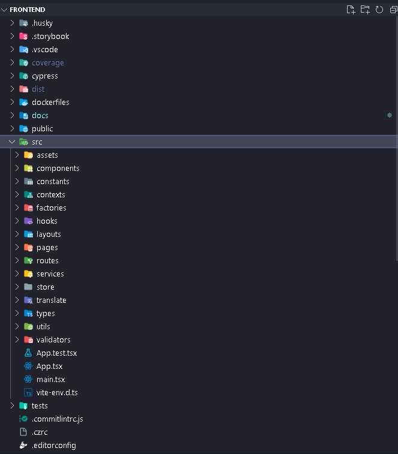

#### Visão Geral

Este documento oferece uma visão técnica detalhada da estrutura do projeto Flag SecOps Hub. Ele descreve a organização dos diretórios, padrões de codificação, e ferramentas específicas utilizadas para manter o projeto escalável, manutenível e eficiente.

Estrutura de Diretórios
Logo abaixo está detalhamento técnico da estrutura de diretórios adotada e o propósito de cada diretório:

- **/assets:** Armazena recursos estáticos como imagens, ícones e folhas de estilo globais. Utilizado para centralizar recursos de mídia e estilos que são usados em toda a aplicação.
- **/components:** Segue o princípio do Atomic Design, dividindo componentes em átomos, moléculas e organismos. Esta estrutura promove reutilização e manutenção ao encapsular a lógica e o estilo de UI.
- **/constants:** Define constantes globais como configurações de API, strings reutilizáveis e valores configuráveis. Isso centraliza informações importantes e facilita mudanças globais.
- **/contexts:** Utiliza o Context API do React para gerenciar estados globais e compartilhar dados entre componentes sem prop drilling.
- **/factories:** Contém funções factory para abstrair a criação de objetos complexos, permitindo flexibilidade e reutilização na criação de instâncias.
- **/hooks:** Custom hooks do React estão aqui para encapsular lógica de estado e efeitos colaterais reutilizáveis, seguindo o princípio DRY.
- **/layouts:** Componentes de layout comuns, como cabeçalhos, rodapés e templates de página. Eles definem a estrutura visual e o comportamento recorrente entre diferentes páginas.
- **/pages:** Contém componentes de página, representando as vistas e funcionalidades acessíveis através das rotas do aplicativo.
- **/routes:** Define a configuração de roteamento do aplicativo, mapeando URLs para componentes de página específicos e gerenciando a navegação.
- **/services:** Agrupa lógica de negócios e comunicação com APIs externas, isolando a lógica de rede do restante do código.
- **/store:** Configuração e lógica do Redux Toolkit para gerenciamento de estado global.
- **/translate:** Arquivos de localização para suportar múltiplos idiomas usando i18next, promovendo internacionalização e acessibilidade.
- **/types:** Tipos TypeScript específicos do projeto e interfaces para garantir a consistência e segurança de tipo no código.
- **/utils:** Funções utilitárias e helpers que são usadas em várias partes do projeto, promovendo reutilização e mantendo o código enxuto.
- **/validators:** Esquemas de validação Yup para formulários, centralizando a lógica de validação e mantendo os componentes limpos.

