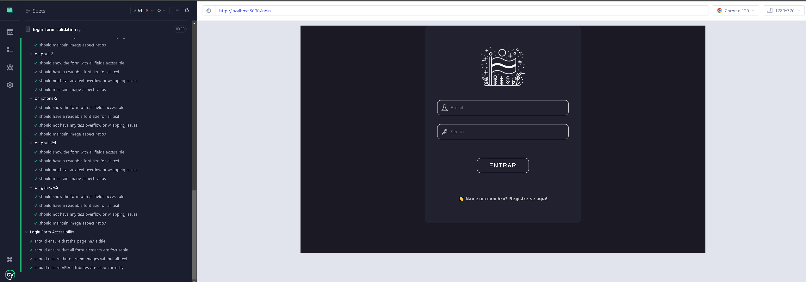

#### Visão Geral

Este documento descreve as estratégias e ferramentas de teste implementadas no Flag-SecOps-Hub, destacando como elas contribuem para manter a qualidade, a segurança e a performance do aplicativo.

Estratégias de Teste Implementadas:

**1. Testes Unitários (Jest):**

Optei por escrever bastante testes unitários no projeto, os testes unitários são usados para verificar a menor parte testável do código individualmente (funções, métodos).
Utilizei o Jest + Testing Library para testar os componentes React, garantindo que eles renderizem corretamente e que os eventos do usuário sejam tratados corretamente.
Benefícios: Assegura que a integração entre módulos ou serviços funcione corretamente, validando os fluxos de negócio e a interação do usuário com a aplicação.

**2. Testes End-to-End (Cypress):**
Implementação: Utilizei Cypress para simular ações do usuário na página de login e na página de cadastro, para garantir que nenhuma pessoa consiga acessar o sistema sem estar autenticada.

**3. Testes de Snapshot (Storybook + Jest):**
Descrição: Captura "fotos" dos componentes UI para garantir que as mudanças visuais sejam intencionais.
Implementação: Utilizei Storybook para visualizar componentes e Jest para capturar e comparar snapshots ao longo do tempo.
Benefícios: Detecta alterações visuais inadvertidas, ajudando a manter a consistência do design e a integridade visual da aplicação.

**4. Linting e Formatação de Código (ESLint + Prettier):**
Descrição: Ferramentas utilizadas para garantir que o código siga um conjunto consistente de regras e estilos, prevenindo erros comuns e mantendo o código padronizado.
Implementação: ESLint identifica padrões problemáticos no código JavaScript/TypeScript, enquanto Prettier formata o código para seguir um estilo consistente.
Benefícios: Aumenta a legibilidade e facilita a manutenção do código, ajudando a prevenir problemas sutis e a manter um alto padrão de qualidade.
