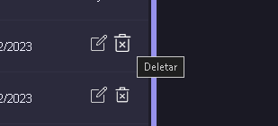
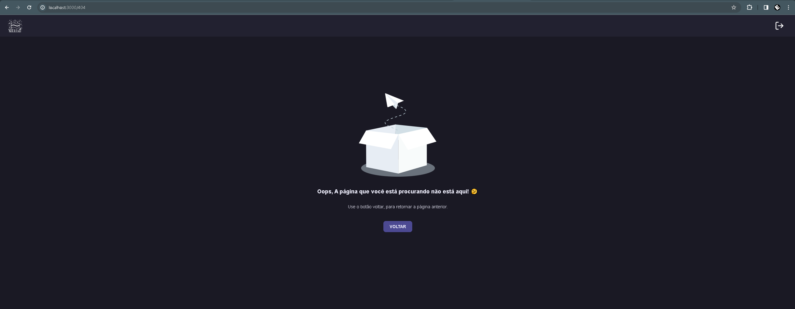

# Implementações de Design de Interface e UX no Flag-SecOps-Hub

## Visão Geral

Neste documento, vou destacar as escolhas específicas de design de interface e experiência do usuário que fiz para tornar o Flag-SecOps-Hub não apenas funcional, mas também visualmente atraente e intuitivo.

## Implementações de Interface

### 1. Design Amigável e Atraente

- **Descrição:** Fiz questão de criar uma interface que fosse visualmente agradável e fácil de navegar, focando em um layout limpo e uma paleta de cores harmoniosa.
- **Detalhes:** A atenção aos detalhes, como espaçamento consistente, tipografia legível e elementos interativos bem posicionados, contribui para uma sensação de conforto e facilidade ao usar o aplicativo.

### 2. Tooltip para Ícones

- **Descrição:** Incluí tooltips que aparecem quando o usuário passa o mouse sobre ícones e elementos que podem requerer explicações adicionais.
- **Detalhes:** Isso ajuda em interfaces dominadas por ícones, garantindo que os usuários compreendam a função de cada elemento sem necessidade de adivinhação.

### 3. Feedback Visual com Alertas

- **Descrição:** Implementei um sistema de alertas para fornecer feedback imediato sobre as ações do usuário, como sucesso, erro ou informação.
- **Detalhes:** Com cores e ícones distintos, os usuários têm uma compreensão clara dos resultados das suas ações ou do estado do sistema, melhorando a comunicação e a confiança no aplicativo.

### 4. Página de Erros Personalizada

- **Descrição:** Desenvolvi uma página de erro personalizada para lidar com situações em que o usuário tenta acessar uma parte desconhecida do aplicativo.
- **Detalhes:** Ao invés de uma mensagem genérica ou uma tela em branco, a página de erro amigável informa ao usuário que ele tentou acessar uma página que não existe, melhorando a experiência mesmo em cenários de erro.

## Justificativa para Escolhas de Design

Cada escolha de design foi meticulosamente pensada para criar uma experiência coesa e agradável. Acredito firmemente que uma interface bem desenhada e funcional não só atrai mais usuários, como também facilita a interação e melhora a eficiência geral.

## Conclusão

As implementações de design de interface e experiência do usuário no Flag-SecOps-Hub foram estrategicamente escolhidas para promover uma experiência agradável e funcional.
