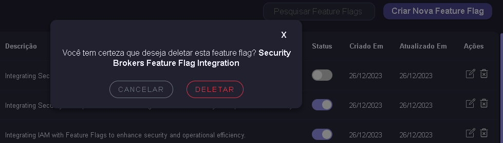

#### Visão Geral

Este documento destaca as implementações específicas de design de interface e experiência do usuário que contribuem para tornar o Flag-SecOps-Hub não apenas funcional, mas também visualmente atraente e intuitivo para os usuários.

Implementações de Interface

**1. Design Amigável e Atraente:**

Descrição: Criei uma interface que é visualmente agradável e fácil de navegar, focando em um layout limpo e uma paleta de cores harmoniosa.
Detalhes: A atenção aos detalhes, como espaçamento consistente, tipografia legível e elementos interativos bem posicionados, contribui para uma sensação de conforto e facilidade ao usar o aplicativo.

**2. Tooltip para Ícones:**

Descrição: Implementei alguns tooltips que aparecem quando o usuário passa o mouse sobre ícones e elementos que podem requerer explicação adicional.
Detalhes: Isso é particularmente útil em interfaces onde predominam ícones, garantindo que os usuários entendam a função de cada elemento sem a necessidade de experimentação ou confusão.

**3. Feedback Visual com Alertas:**

Descrição: Adicionei um sistema de alertas para fornecer feedback imediato sobre ações de sucesso, erro, ou informações sobre o status de requisições à API.
Detalhes: Usando cores e ícones distintos para sucesso, erro e alertas, os usuários recebem uma compreensão clara do resultado de suas ações ou do estado do sistema, melhorando a comunicação e a confiança no aplicativo.

Justificativa para Escolhas de Design
O design foi meticulosamente pensado para criar uma experiência coesa e agradável. Acredito que uma interface bonita e funcional não apenas atrai usuários, mas também facilita a interação e aumenta a eficiência.

**4. Página de Erros Personalizada**
Descrição: Criei uma página de erro personalizada para lidar com situações em que o usuário navega para um local desconhecido.
Detalhes:
Navegação para Rotas Desconhecidas: Em vez de simplesmente mostrar uma mensagem de erro genérica ou uma tela em branco, criamos uma página de erro amigável que informa ao usuário que ele tentou acessar uma página que não existe. Isso pode acontecer se eles digitam um URL errado ou seguem um link quebrado.

